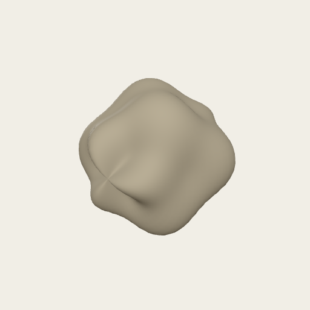

# delete-3

Throwaway test set made by the smoke test.

- License: CC BY 4.0 (see `LICENSE.txt`)
- Curated by [@muratmaga](https://github.com/muratmaga)
- Created with [models.morphodepot.org](https://models.morphodepot.org), part of [MorphoDepot](https://morphodepot.org)
- **Download all models:** [v4 (zip)](https://github.com/muratmaga/delete-3/archive/refs/tags/v4.zip)

## Models (7)

### Aphonopelma chalcodes (2)

| | Model | Specimen | Triangles | Format | Source |
|---|---|---|---|---|---|
|  | [sphere ply](models/sphere.ply) | UWBM 1 | 3,968 | PLY | surface scan |
|  | [sphere obj](models/sphere.obj) | UWBM 2 | 3,968 | OBJ | surface scan |

### Species not given (5)

| | Model | Specimen | Triangles | Format | Source |
|---|---|---|---|---|---|
|  | [sphere stl (ascii now)](models/sphere.stl) |  |  | STL |  |
|  | [sphere vtk](models/sphere.vtk) |  | 3,968 | VTK | surface scan |
|  | [sphere-42.vtk](models/sphere-42.vtk) |  |  | VTK |  |
|  | [sphere-ascii](models/sphere-ascii.ply) |  | 3,968 | PLY |  |
|  | [sphere-ascii](models/sphere-ascii.vtk) |  | 3,968 | VTK |  |
